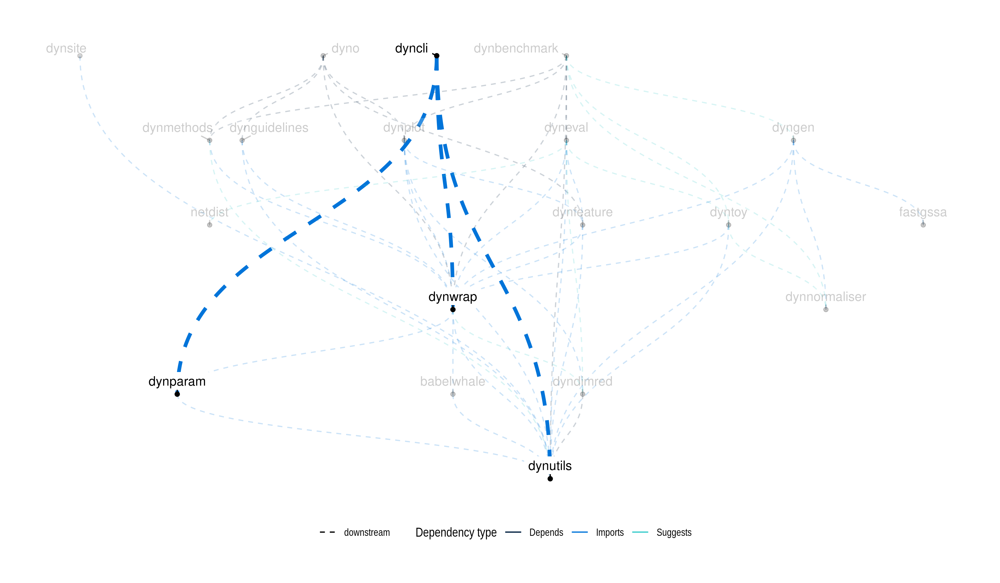

---
output:
  github_document:
    html_preview: false
editor_options: 
  chunk_output_type: console
---

<!-- README.md is generated from README.Rmd. Please edit that file -->

```{r, echo = FALSE, message = FALSE, error = FALSE, warning = FALSE}
library(tidyverse)
```

# dyncli: CLI Helper for Trajectory Inference Methods

[](https://github.com/dynverse/dyncli/actions?query=workflow%3AR-CMD-check)
[](https://codecov.io/gh/dynverse/dyncli)

dyncli helps creating a standalone Docker container for trajectory inference (TI) methods using dynwrap by auto-generating CLI and input/output file management based on the TI method's functionality.yml. Please see the vignette (`vignette("create_ti_method_script", package = "dyncli")`) for more information on the requirements for using dyncli.

Other examples can be found at repositories such as [dynverse/ti_comp1](https://github.com/dynverse/ti_comp1), [dynverse/ti_paga](https://github.com/dynverse/ti_paga), [dynverse/ti_gng](https://github.com/dynverse/ti_gng).


## Latest changes

Check out `news(package = "dyncli")` or [NEWS.md](NEWS.md) for a full list of changes.

<!-- This section gets automatically generated from inst/NEWS.md -->

```{r news, echo=FALSE, results="asis"}
cat(dynutils::recent_news())
```

## Dynverse dependencies

<!-- Generated by "update_dependency_graphs.R" in the main dynverse repo -->

